# Digital Image Carving Using Scalpel

-   On ubuntu ran the following command:

    -   sudo apt install p7zip-full hashdeep sleuthkit scalpel tree -y

<!-- -->

-   Following command did not work (file was downloaded as an html):
    wget -q
    [[https://github.com/yaukacheung/csci352/blob/main/A1/120M.7z]{.underline}](https://github.com/yaukacheung/csci352/blob/main/A1/120M.7z)

    -   Had to download manually from github website and ran the
        following command:

        -   mv /mnt/c/Users/tyler/Downloads/120M.7z \~/

-   Ran:

    -   7z l 120M.7z

    -   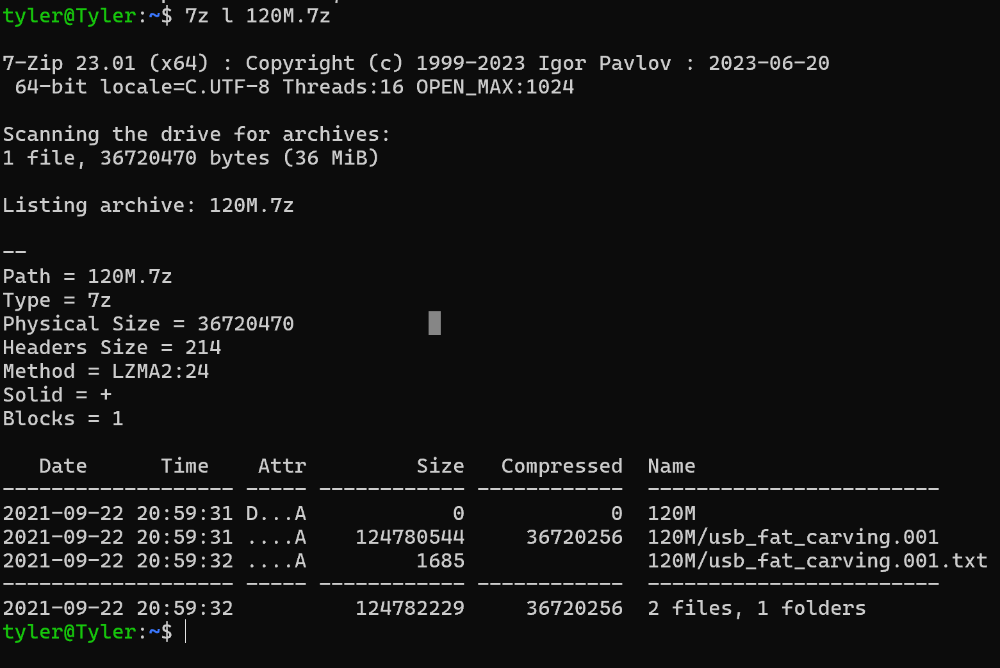

<!-- -->

-   To extract file, Ran :

    -   7z e 120M.7z

    -   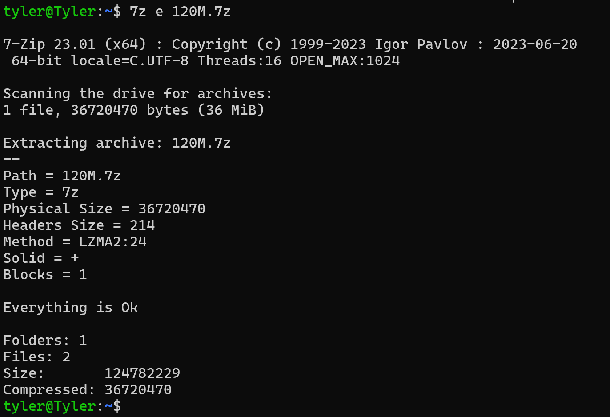

<!-- -->

-   To verify hashes, Ran:

    -   hashdeep -c md5, sha1 usb_fat_carving.001

    -   And

    -   Cat usb_fat_carving.001.txt

    -   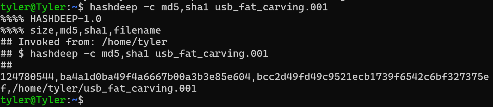

    -   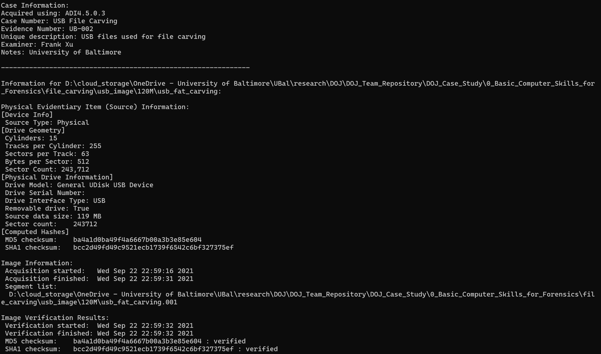

<!-- -->

-   To display and look at partitions:

    -   Fdisk -l usb_fat_carving.001

    -   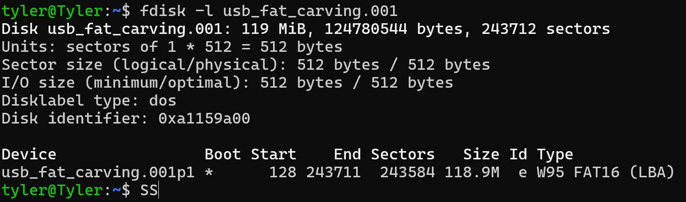

<!-- -->

-   To find deleted files (\* mean deleted files):

    -   Fls -o 128 usb_fat_carving.001

    -   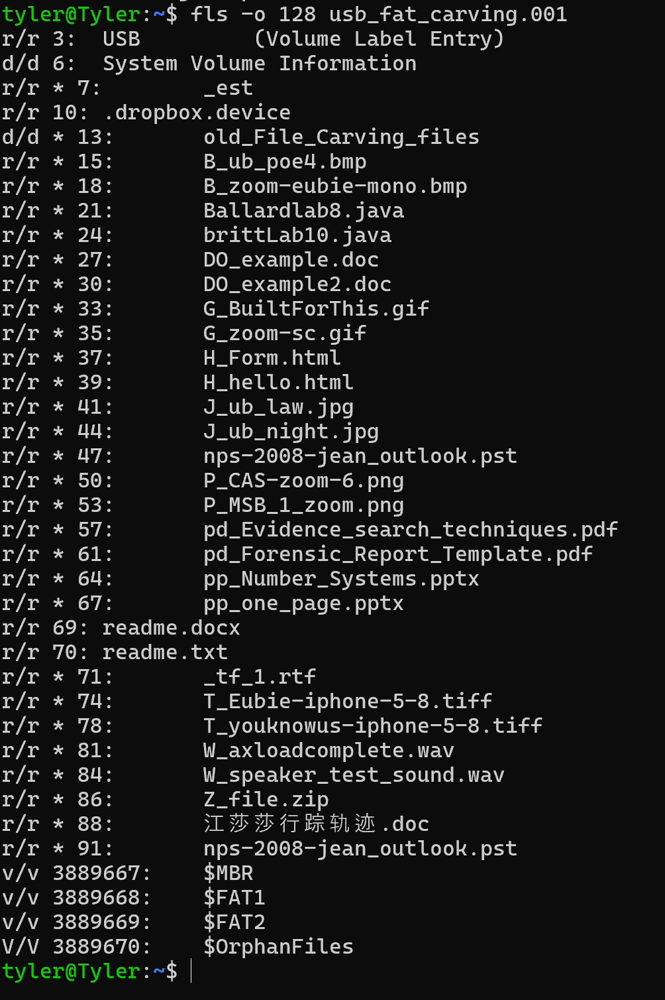

-   To decide which files to carve:

    -   Sudo leafpad /etc/scalpel/scalpel.conf

    -   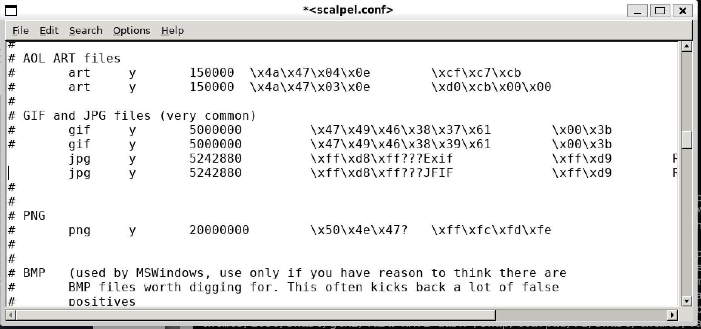

-   To carve the image:

    -   scalpel usb_fat_carving.001 -o output

    -   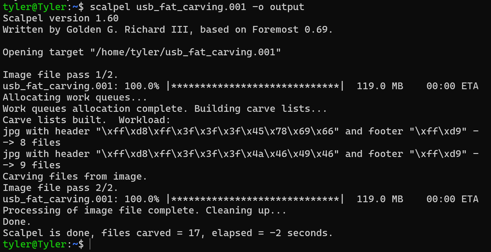

-   To see carved files:

    -   Tree output

    -   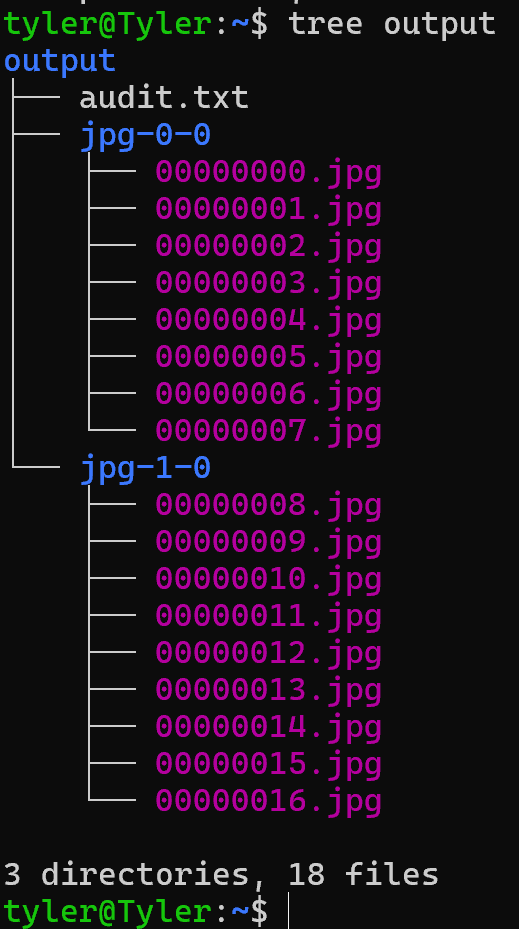

-   Show audit logs:

    -   Cat output/audit.txt

    -   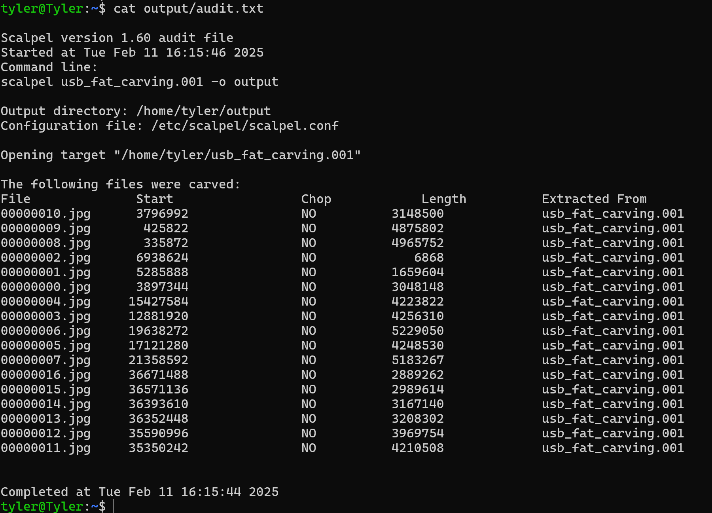

-   Displayed images with

    -   Display output/jpg-0-0/file_name.jpg

    -   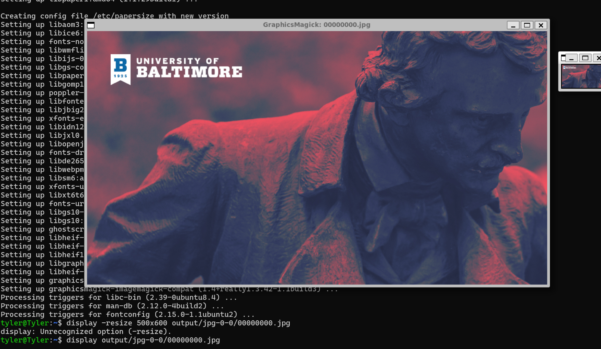

    -   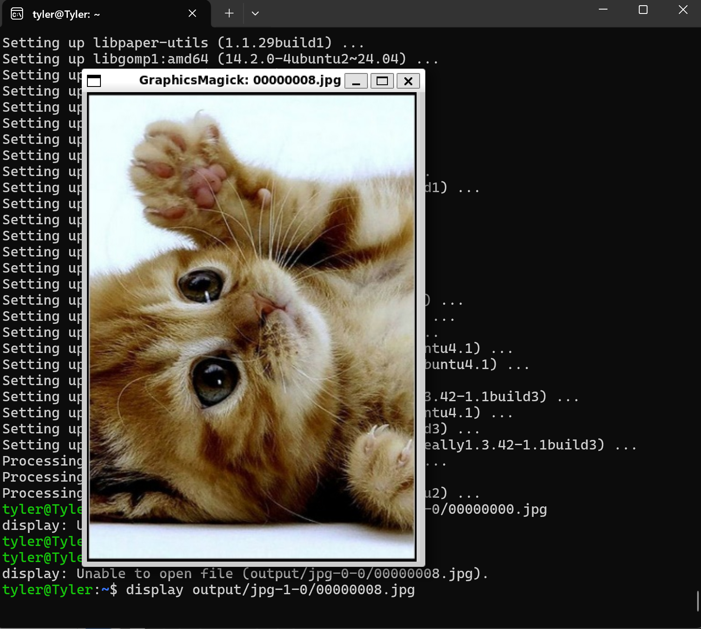

    -   Had to download the display package with : sudo apt install
        graphicsmagick-imagemagick-compat \# version 1.4+really1.3.42-1
